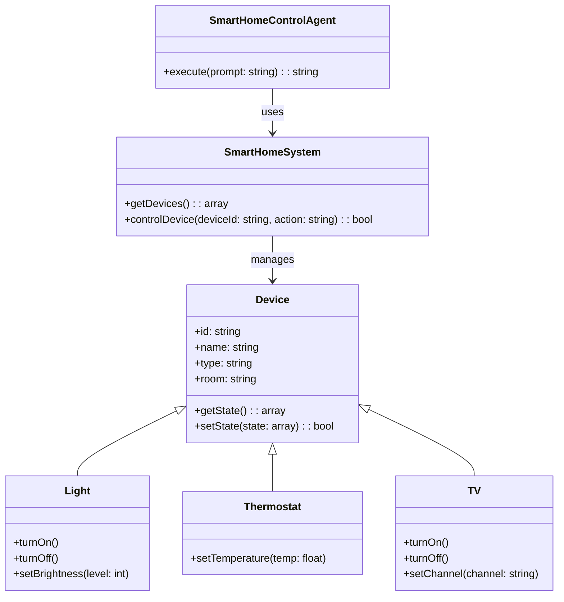

# Smart Home control system with LLM Agents

[](https://packagist.org/packages/llm-agents-php/agent-smart-home-control)
[](https://packagist.org/packages/llm-agents-php/agent-smart-home-control)
[](https://packagist.org/packages/llm-agents-php/agent-smart-home-control)

This nifty tool lets you boss around your smart home devices using plain old English. No more fumbling with apps or
remembering device names!

## 🚀 What's This All About?

Imagine telling your house, "I'm cold" and having it crank up the heat. Or saying, "Movie night!" and watching your
living room transform into a mini-cinema. That's what we're doing here! We've got an AI agent that understands what you
want and makes it happen.

> You can read an article about Smart Home control system with LLM Agents
> on [Medium](https://butschster.medium.com/a-php-devs-dream-an-ai-home-that-really-gets-you-dd97ae2ca0b0).


## 🛠 What You'll Need

- PHP 8.3 or later (we're using some fancy new features!)
- An LLM service (like OpenAI's GPT-4)

## Let's get started! 🚀

### Installation

First things first, let's get this package installed:

```bash
composer require llm-agents-php/agent-smart-home-control
```

### Setup in Spiral Framework

To get the Site Status Checker Agent up and running in your Spiral Framework project, you need to register its
bootloader.

**Here's how:**

1. Open up your `app/src/Application/Kernel.php` file.
2. Add the bootloader like this:

```php
public function defineBootloaders(): array
{
    return [
        // ... other bootloaders ...
        \LLM\Agents\Agent\SmartHomeControl\Integrations\Spiral\SmartHomeControlBootloader::class,
    ];
}
```

And that's it! Your Spiral app is now ready to use the agent.

## 🏗 Class Diagram

Here's a quick look at how everything fits together:



## Want to help out? 🤝

We love contributions! If you've got ideas to make this agent even cooler, here's how you can chip in:

1. Fork the repo
2. Make your changes
3. Create a new Pull Request

Just make sure your code is clean, well-commented, and follows PSR-12 coding standards.

## License 📄

This project is licensed under the MIT License - see the [LICENSE](LICENSE) file for details.

---

That's all, folks! If you've got any questions or run into any trouble, don't hesitate to open an issue.